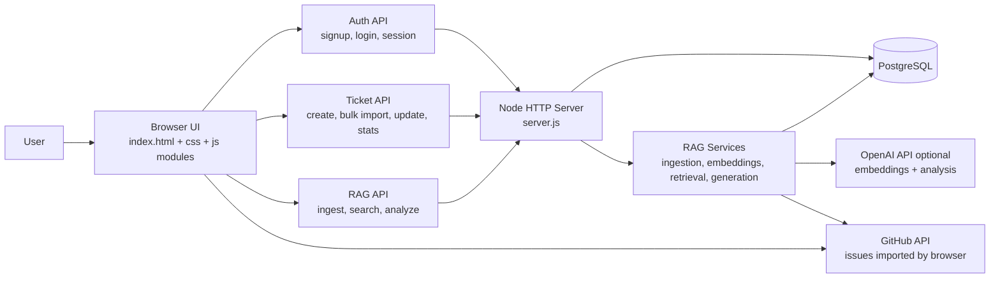
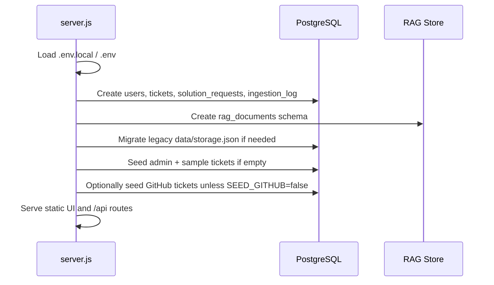
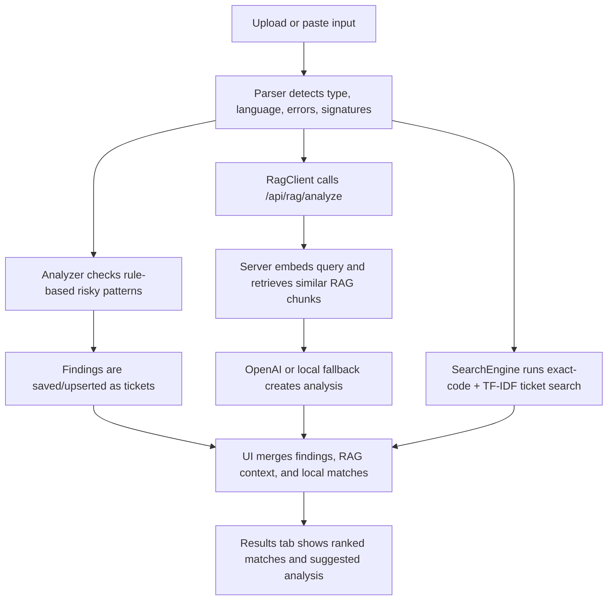
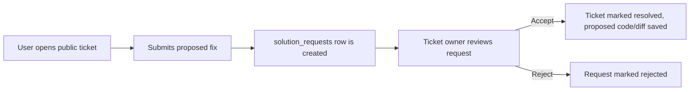
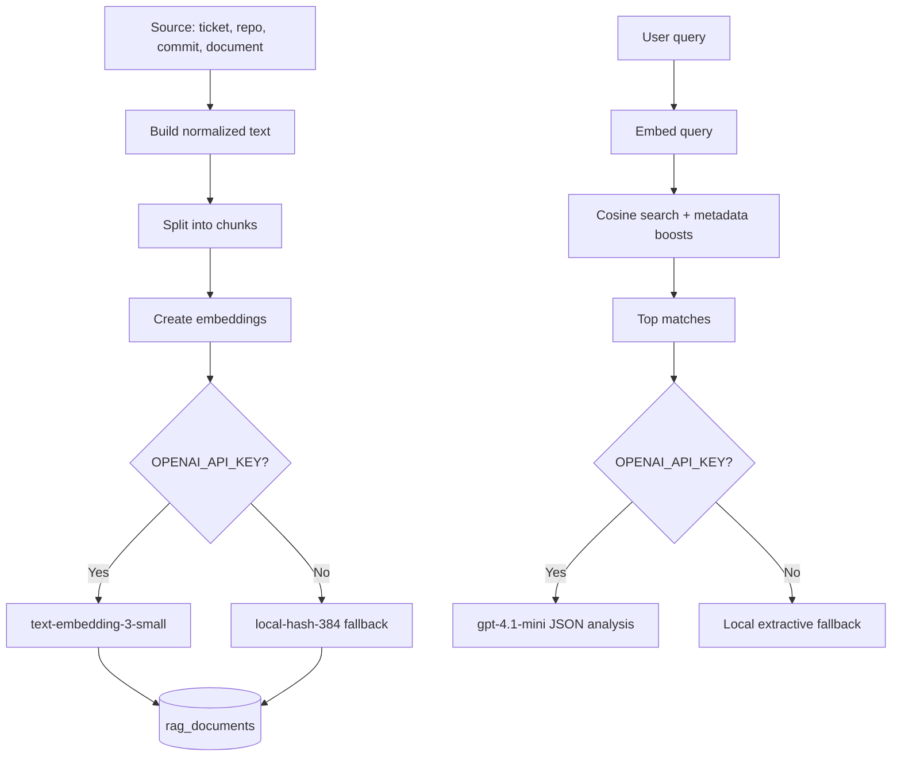

# BugRelayAI Architecture

BugRelayAI is a small full-stack bug triage app. The browser UI lets users upload logs/code, import GitHub issues, search similar historical bugs, save tickets, and request or approve fixes. A single Node server owns authentication, PostgreSQL persistence, ticket APIs, and RAG services.

## System View

## Main Parts

| Area | Files | Responsibility |
| --- | --- | --- |
| UI shell | `index.html`, `css/styles.css`, `js/ui.js` | Auth screen, tabs, upload form, modals, ticket rendering, event wiring. |
| Browser data/API layer | `js/db.js`, `js/rag.js` | Stores JWT in `localStorage`, calls backend APIs, caches tickets/stats locally. |
| Client analysis | `js/parser.js`, `js/search.js`, `js/analyzer.js` | Parses logs/code, detects risky patterns, runs TF-IDF/exact-code search, creates findings. |
| GitHub import | `js/github.js` | Fetches public GitHub issues, maps them into tickets, resumes after rate limits. |
| Backend/API | `server.js` | Static file server, auth, ticket CRUD, solution requests, stats, DB bootstrapping, route dispatch. |
| RAG backend | `server/rag/*` | Chunks sources, embeds content, stores/searches vectors, generates RAG analysis. |
| Data | PostgreSQL tables | Users, tickets, solution requests, ingestion log, RAG documents. |

## Startup Flow

## Important User Flows

### 1. Sign In

1. User logs in or signs up from the browser.
2. `server.js` hashes passwords with `bcryptjs` and signs JWTs with `jsonwebtoken`.
3. The browser stores `btai_jwt` and `btai_user` in `localStorage`.
4. Later API requests send `Authorization: Bearer <token>`.

### 2. Analyze Code or Logs

The app deliberately uses two search layers:

- Local browser search for fast exact-code and TF-IDF matching over visible tickets.
- Server RAG search for semantic matches across indexed tickets, GitHub issues, PRs, commits, and documents.

### 3. Ticket Lifecycle

1. Tickets enter the system from manual creation, GitHub import, static analysis findings, production logs, commits, or RAG ingestion.
2. `server.js` normalizes fields, allocates IDs like `BUG-001`, and deduplicates by `findingFingerprint`, `sourceKey`, `sourceUrl`, or explicit ID.
3. Visibility controls access:
   - `private`: only the creator can see it.
   - `public`: visible to all authenticated users.
4. Resolved tickets can store fixed code, diffs, and solution text.
5. Created/resolved tickets are indexed into RAG when possible.

### 4. Public Fix Approval

This keeps public collaboration controlled: non-owners can propose a resolution, but only the ticket creator can accept it.

### 5. Learning Sources

- GitHub Issues Integration:
  - Browser calls GitHub, converts issues to tickets, and saves them through `/api/tickets/bulk`.
  - A background server RAG ingest can also index GitHub issues, pull requests, and commits.
- Production Logs:
  - Browser parses a pasted log into a high-priority ticket.
- Commit Messages/Diffs:
  - Browser converts a commit message or diff into a resolved ticket.
- Generic RAG Documents:
  - `/api/rag/ingest` can accept documents, commit text, repo names, or ticket IDs.

## RAG Pipeline

RAG works without OpenAI credentials by using local hash embeddings and a local generated summary. With `OPENAI_API_KEY`, it uses OpenAI embeddings and response generation for higher-quality analysis.

## Data Model

| Table | Purpose |
| --- | --- |
| `users` | Account records with hashed passwords. |
| `tickets` | Main bug database: status, visibility, priority, snippets, solution, source metadata, dedupe keys. |
| `solution_requests` | Pending/accepted/rejected proposed fixes for public tickets. |
| `ingestion_log` | History of imports, analysis runs, and learning-source activity. |
| `rag_documents` | Chunked source documents plus embeddings and metadata for semantic search. |

## Runtime and Deployment

- Local start: `npm start` from `bug-triage-tool`.
- Tests: `npm test` runs focused RAG tests.
- Database: PostgreSQL via `DATABASE_URL`; default is local `bugtriageai`.
- Config files: `.env.local`, `.env`, `.env.example`.
- Vercel: `vercel.json` routes all requests to `server.js` and disables GitHub seed with `SEED_GITHUB=false`.

## Design Notes

- The project intentionally avoids a frontend build step: the browser loads plain JS modules in a fixed order.
- `server.js` is the main backend boundary; route handlers are simple functions instead of an Express app.
- Client-side analysis keeps the UI responsive and useful even when RAG or OpenAI is unavailable.
- PostgreSQL is the source of truth; browser state is only a cached API view.
- RAG is additive: ticket creation and search still work if embeddings or generation fall back locally.
